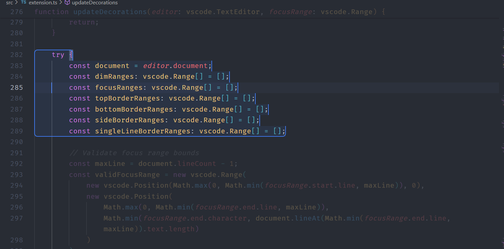

# 🚀 Focus Highlight Tool

> ⚡ Highlight selected code and dim the rest to help **focus during recordings**, presentations, or tutorials.

**Perfect for developers, educators, YouTubers, and streamers!** This extension gives you a "select tool" like in image editing software, but for code. Highlight the area you want to talk about, and automatically dim the rest of the file to keep the viewer focused.

---

## 📸 Preview



---

## ✨ Features

✅ Highlight a portion of code by **clicking and dragging**  
✅ Automatically dims the rest of the code to focus attention  
✅ Easy-to-toggle with hotkeys  
✅ Useful for:
- Tutorial videos
- Livestreams
- Presentations
- Teaching / Pair programming

---

## 🧑‍💻 How to Use

1. Open a file in VS Code.
2. Press `Ctrl + J` (or `Cmd + J` on macOS) to **activate the highlight tool**.
3. **Click and drag with the left mouse button** to select a block of code.
4. The selected area will be highlighted; all other lines will be dimmed.
5. **Release the left click** to finish selection.  
6. Use shortcuts below to clear or toggle.

---

## 🎹 Keyboard Shortcuts

| Action                          | Windows / Linux       | macOS              |
|-------------------------------|------------------------|--------------------|
| 🔁 Toggle Focus Mode           | `Ctrl + Alt + H`       | `Cmd + Alt + H`    |
| 🎯 Activate Focus Mode         | `Ctrl + J`             | `Cmd + J`          |
| ❌ Deactivate Focus Mode       | `Ctrl + Shift + J`     | `Cmd + Shift + J`  |
| 🧹 Clear Highlight             | `Ctrl + Shift + C`     | `Cmd + Shift + C`  |
| 📐 Start Line Range Selection  | `Ctrl + Shift + L`     | `Cmd + Shift + L`  |

---

## 🛠️ Extension Commands

| Command                       | Description                                 |
|------------------------------|---------------------------------------------|
| `Toggle Focus Highlight`     | Toggle on/off the focus highlight globally  |
| `Activate Focus Highlight`   | Start the highlight selection mode          |
| `Deactivate Focus Highlight` | Turn off highlight and restore editor view  |
| `Clear Focus Selection`      | Remove all highlights                       |
| `Select Line Range`          | Manually select a line range to highlight   |

---

## 🔧 Settings / Customization (Coming Soon)

Future versions may support:
- Color themes
- Multiple highlight blocks
- Persistent highlight across files

---

## 📂 Folder Structure

```plaintext
focus-highlight-tool/
├── src/
│   └── extension.ts         # Main source code
├── out/
│   └── extension.js         # Compiled output
├── icon.png                 # Extension icon
├── package.json             # Extension manifest
├── README.md                # You're here!
├── LICENSE.MD               # Open-source license
└── .vscodeignore            # Files to exclude in package
